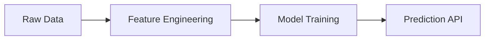
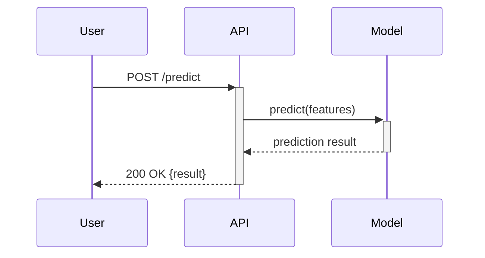
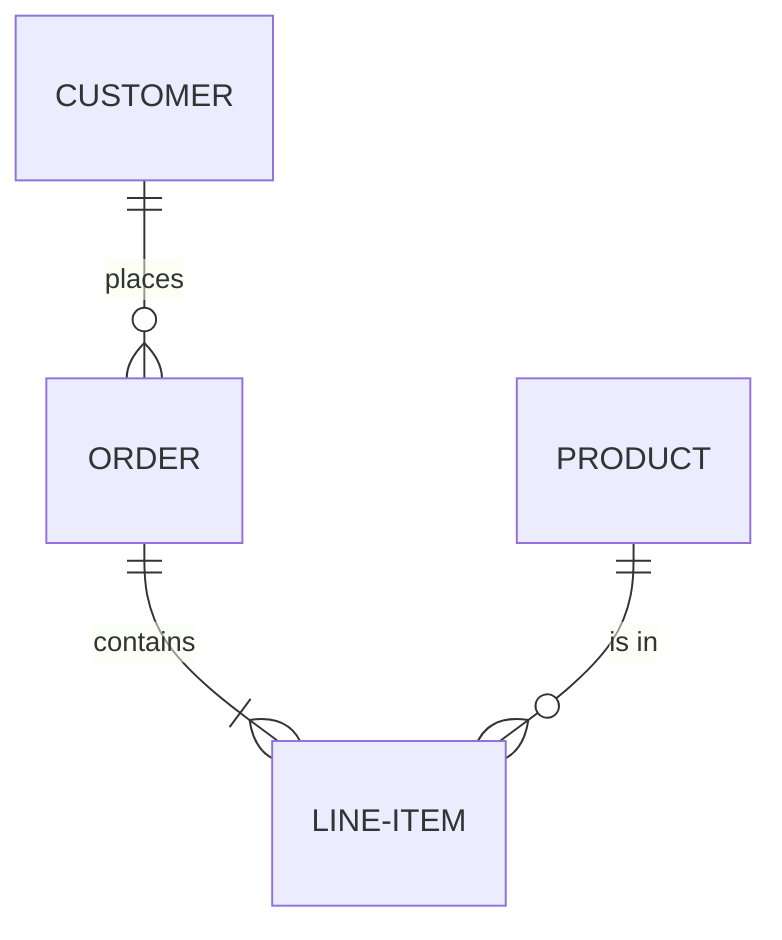

# VS Code Extensions — Standard Catalog

> **Module:** 01 — Programming Best Practices  
> **Date:** 2026-03-09  
> **Purpose:** Standardized list of VS Code extensions for all development teams

---

## How to Install Extensions

### From the Extensions Panel

1. Press `Ctrl+Shift+X` to open the **Extensions** sidebar
2. Search by name or extension ID (format: `publisher.extension-name`)
3. Click **Install**

### From the Command Line

```bash
code --install-extension <extension-id>
```

> At the bottom of this document you'll find a **bulk install script** and an `extensions.json` file to set up the full catalog at once.

---

## 1 — Core Python Development (Mandatory)

These extensions are **required for every team member**. They provide the foundation for writing, analyzing, and debugging Python code.

---

### 1.1 Python

| | |
|---|---|
| **Extension ID** | `ms-python.python` |
| **Publisher** | Microsoft |
| **Install** | [Marketplace](https://marketplace.visualstudio.com/items?itemName=ms-python.python) |

The **foundational extension** — turns VS Code into a full Python IDE. All other Python-related extensions depend on it.

#### Key Capabilities

| Feature | Description | Shortcut |
|---------|-------------|----------|
| **IntelliSense** | Auto-completion of functions, methods, and parameters. Powered by **Pylance**. | Automatic as you type |
| **Environment detection** | Auto-detects `venv`, `conda`, and `poetry` environments. Select via the status bar (bottom-left). | Click status bar |
| **Go to Definition** | Jump to where a function/class is defined, even across files. | `F12` / `Ctrl+Click` |
| **Find All References** | List every usage of a symbol across the project. | `Shift+F12` |
| **Go to Symbol** | Search functions, classes, variables in the current file. | `Ctrl+Shift+O` |
| **Rename Symbol** | Rename a variable/function across all files at once. | `F2` |
| **Extract Method** | Select code → right-click → extract into a new function. | Context menu |

#### Integrated Linting

The extension surfaces lint errors as underlines in the editor (red = error, yellow = warning) and aggregates them in the **Problems panel** (`Ctrl+Shift+M`). The proposed standard linter is **Ruff** (more details in next sessions).

#### Formatting

Auto-format with `Shift+Alt+F` or enable **format on save**. The proposed standard formatter is **Black**. The formatter ensures consistent style across the team without manual effort.

#### Test Explorer

Visual panel to discover, run, and inspect pytest/unittest results. Enable via `Ctrl+Shift+P` → "Python: Configure Tests" → choose pytest.

---

### 1.2 Python Debugger

| | |
|---|---|
| **Extension ID** | `ms-python.debugpy` |
| **Publisher** | Microsoft |
| **Install** | [Marketplace](https://marketplace.visualstudio.com/items?itemName=ms-python.debugpy) |

Dedicated debug engine for Python (based on `debugpy`). Provides breakpoints, step controls, variable inspection, watch expressions, and the Debug Console.

**Key features:** regular/conditional/logpoint breakpoints, step over/into/out, call stack navigation, variable explorer, and an interactive Debug Console that evaluates expressions in the paused context.

> **Every developer must be proficient with the debugger.** See the **`debug/`** folder in this module for a 3-part masterclass: [01_fundamentals](debug/01_fundamentals.ipynb) → [02_intermediate](debug/02_intermediate.ipynb) → [03_advanced](debug/03_advanced.ipynb).

---

### 1.3 GitHub Copilot

| | |
|---|---|
| **Extension ID** | `GitHub.copilot` |
| **Publisher** | GitHub |
| **Install** | [Marketplace](https://marketplace.visualstudio.com/items?itemName=GitHub.copilot) |

**What is GitHub Copilot?** An AI assistant that lives inside VS Code. It watches what you're typing and suggests code completions, entire functions, docstrings, and even tests — based on the context of your project.

#### Inline Code Completion

As you type, Copilot shows **ghost text** (gray, semi-transparent suggestions). Press `Tab` to accept, or keep typing to ignore.

```python
# You type this comment:
# function that reads a CSV file and returns a pandas DataFrame

# Copilot suggests (in gray):
def read_csv_to_dataframe(file_path: str) -> pd.DataFrame:
    """Read a CSV file and return a pandas DataFrame."""
    return pd.read_csv(file_path)
```

#### Chat Interface

Press `Ctrl+Shift+I` to open the **Copilot Chat** panel. You can ask questions in natural language:

- *"Explain what this function does"*
- *"Write a pytest test for this class"*
- *"Refactor this to use list comprehension"*
- *"Why am I getting a KeyError on line 42?"*

#### Slash Commands

In the chat or inline, use slash commands for targeted actions:

| Command | What it does | Example |
|---------|-------------|---------|
| `/explain` | Explain selected code in plain English | Select a complex function → `/explain` |
| `/fix` | Suggest a fix for an error or bug | Select erroring code → `/fix` |
| `/tests` | Generate unit tests for selected code | Select a function → `/tests` |
| `/doc` | Generate a docstring for a function | Place cursor in function → `/doc` |

#### Important Rules

> **All AI-generated code must be reviewed, tested, and understood before committing.** Copilot is an accelerator, not a substitute. Never commit code you don't fully understand.

---

### 1.4 Claude Code (Anthropic)

| | |
|---|---|
| **Extension ID** | `anthropic.claude-code` |
| **Publisher** | Anthropic |
| **Install** | [Marketplace](https://marketplace.visualstudio.com/items?itemName=anthropic.claude-code) |

Claude Code is Anthropic's AI coding assistant, complementary to GitHub Copilot. It provides an **agentic terminal-based interface** for multi-step coding tasks: refactoring across files, writing tests, debugging complex issues, and answering questions about the codebase.

#### Key Capabilities

| Feature | Description |
|---------|-------------|
| **Codebase Q&A** | Ask questions about the project and get answers grounded in your actual files |
| **Multi-file edits** | Describe a refactor in natural language → Claude applies changes across multiple files |
| **Terminal integration** | Runs commands, reads output, and iterates — useful for debugging build failures |
| **Git workflows** | Generate commit messages, PR descriptions, and changelogs from diffs |
| **Test generation** | Generates pytest tests with context-aware assertions |

#### Usage

1. Open the terminal palette: `Ctrl+Shift+P` → **"Claude: Open Claude Code"**
2. Type your request in natural language
3. Review the proposed changes before accepting

> **Same rules as Copilot apply:** review all generated code, understand it, and test it before committing. Use Claude Code and Copilot as complementary tools — Copilot for inline completions, Claude for larger multi-step tasks.

---

### 1.5 autoDocstring

| | |
|---|---|
| **Extension ID** | `njpwerner.autodocstring` |
| **Publisher** | Nils Werner |
| **Install** | [Marketplace](https://marketplace.visualstudio.com/items?itemName=njpwerner.autodocstring) |

Generates **docstring templates** automatically. Type `"""` below a function signature and press `Enter` — the extension reads the parameters and type hints to pre-fill the structure.

**Example:**

```python
def calculate_discount(price: float, discount_pct: float, min_price: float = 0.0) -> float:
    """                          # ← Type """ + Enter here
```

**Generated template (Google Style):**

```python
def calculate_discount(price: float, discount_pct: float, min_price: float = 0.0) -> float:
    """_summary_

    Args:
        price (float): _description_
        discount_pct (float): _description_
        min_price (float, optional): _description_. Defaults to 0.0.

    Returns:
        float: _description_
    """
```

Press `Tab` to jump between placeholders and fill in descriptions.

#### Configuration

The proposed standard is **Google Style** docstrings (`Args:`, `Returns:`, `Raises:` sections). To configure it:

1. Open the VS Code settings file: `Ctrl+Shift+P` → type **"Preferences: Open Settings (JSON)"** → press Enter.  
   This opens a file called `settings.json` where VS Code stores all user-level configuration as key-value pairs.
2. Add (or merge) the following entry:

```json
{
    "autoDocstring.docstringFormat": "google"
}
```

> **Note:** If the file already has other settings, just add the `"autoDocstring.docstringFormat": "google"` line inside the existing `{ }` braces, separated by commas. Alternatively, for project-level settings shared with the team, place this in `.vscode/settings.json` at the root of your repository (same folder as the `extensions.json` described at the end of this document).

> Type hints (`price: float`, `-> float`) are strongly recommended — they feed both autoDocstring templates and static analysis tools like **mypy** and **Pylance**.

---

### 1.6 GitLens

| | |
|---|---|
| **Extension ID** | `eamodio.gitlens` |
| **Publisher** | GitKraken |
| **Install** | [Marketplace](https://marketplace.visualstudio.com/items?itemName=eamodio.gitlens) |

Supercharges the built-in Git capabilities of VS Code. Essential for understanding code history, tracking changes, and collaborating effectively.

#### Key Features

| Feature | Description |
|---------|-------------|
| **Inline blame** | Shows who last modified each line and when, directly in the editor (gray annotation at end of line) |
| **File history** | View the full commit history of any file — who changed what, when, and why |
| **Line history** | Right-click a line → "Open Line History" to see every commit that touched it |
| **Compare branches** | Visual diff between branches, commits, or tags |
| **Git graph** | Interactive branch/commit visualization (sidebar icon) |
| **Stash explorer** | Browse and apply stashed changes |

> Particularly useful when working with the team's branching strategy (`master → qa → dev`) — quickly compare branches, inspect PR changes, and understand code ownership.

---

## 2 — Notebooks & Data Exploration (Mandatory)

These extensions let you work with **Jupyter Notebooks** directly in VS Code — essential for data analysis, experimentation, and visualization.

---

### 2.1 Jupyter

| | |
|---|---|
| **Extension ID** | `ms-toolsai.jupyter` |
| **Publisher** | Microsoft |
| **Install** | [Marketplace](https://marketplace.visualstudio.com/items?itemName=ms-toolsai.jupyter) |

Run Jupyter Notebooks (`.ipynb`) directly in VS Code — code cells with inline output, Markdown cells for documentation, and interactive visualizations.

#### Key Features

- **Create a notebook:** `Ctrl+Shift+P` → "Create: New Jupyter Notebook"
- **Run a cell:** `Shift+Enter` — output appears below the cell
- **Kernel selector** (top-right): choose which Python environment runs the cells. Restart the kernel (`Ctrl+Shift+P` → "Restart Kernel") to reset state.

> The use notebooks is recommended for **exploration and prototyping only**. Production code must be extracted into proper Python files (.py).

---

### 2.2 Data Wrangler

| | |
|---|---|
| **Extension ID** | `ms-toolsai.datawrangler` |
| **Publisher** | Microsoft |
| **Install** | [Marketplace](https://marketplace.visualstudio.com/items?itemName=ms-toolsai.datawrangler) |

Visual, spreadsheet-like interface for exploring and transforming pandas DataFrames. Launch it from the Variable Explorer in a notebook by clicking the Data Wrangler icon next to a DataFrame variable.

#### What You Get

- **Column summaries:** data type, missing values count, mini histogram per column
- **Interactive operations:** sort, filter, rename, change dtype, fill missing values, group by — all from a point-and-click menu
- **Auto-generated pandas code:** every visual transformation generates the equivalent Python code, which you can copy into your script for reproducibility

**Example — after filtering, dropping a column, and sorting in the UI, Data Wrangler generates:**

```python
df = df[df["price"] > 100]
df = df.drop(columns=["internal_id"])
df = df.sort_values("date", ascending=False)
```

> Useful for quick data exploration. The generated code ensures your work is reproducible and can be moved into production scripts.

---

## 3 — Data Platform (Mandatory)

---

### 3.1 Snowflake

| | |
|---|---|
| **Extension ID** | `snowflake.snowflake-vsc` |
| **Publisher** | Snowflake |
| **Install** | [Marketplace](https://marketplace.visualstudio.com/items?itemName=snowflake.snowflake-vsc) |

Brings the Snowflake experience into VS Code — connect to your account, browse objects, and run SQL queries without switching to the web UI.

#### Connection Setup

1. Click the **Snowflake icon** in the left sidebar
2. **Add Connection** → enter account URL, username, role, warehouse
3. Authenticate (password, SSO, or key-pair)

#### Key Features

- **Object Explorer:** tree view of databases, schemas, tables, stages. Click a table to see columns and types; right-click → "Preview Data" for sample rows.
- **SQL Worksheets:** open a `.sql` file, write queries, execute with `Ctrl+Enter`. Results appear in a sortable/filterable grid.
- **Snowpark & UDFs:** browse and test Python UDFs deployed to Snowflake stages — useful for Snowpark development workflows (see Module 02).

---

## 4 — Documentation & Diagramming (Mandatory)

All project documentation is written in **Markdown**. These extensions improve the authoring and preview experience.

---

### 4.1 Markdown All in One

| | |
|---|---|
| **Extension ID** | `yzhang.markdown-all-in-one` |
| **Publisher** | Yu Zhang |
| **Install** | [Marketplace](https://marketplace.visualstudio.com/items?itemName=yzhang.markdown-all-in-one) |

#### What This Extension Does

Productivity features for Markdown editing: live preview, shortcuts, TOC generation, and auto list continuation.

| Feature | How |
|---------|-----|
| **Live Preview** | `Ctrl+Shift+V` (full) or `Ctrl+K V` (side-by-side) |
| **Bold / Italic** | `Ctrl+B` / `Ctrl+I` |
| **Toggle checkbox** | `Alt+C` |
| **Generate TOC** | `Ctrl+Shift+P` → "Create Table of Contents" (auto-updates on save) |
| **Auto list continuation** | Press `Enter` at end of a list item → next marker added automatically |

---

### 4.2 Markdown Mermaid

| | |
|---|---|
| **Extension ID** | `bierner.markdown-mermaid` |
| **Publisher** | Matt Bierner |
| **Install** | [Marketplace](https://marketplace.visualstudio.com/items?itemName=bierner.markdown-mermaid) |

Adds **Mermaid diagram rendering** to the Markdown preview. Write diagram code in fenced ` ```mermaid ` blocks and see them rendered visually.

**Why text-based diagrams?** They’re version-controllable (Git diffs), easy to update, and render in GitHub READMEs / MkDocs sites.

#### Examples

**Flowchart:**
````markdown

````

**Sequence diagram:**
````markdown

````

**ER diagram:**
````markdown

````

> **Rule:** Use Mermaid for all architecture, data flow, and process diagrams in documentation.

---

### 4.3 Excalidraw

| | |
|---|---|
| **Extension ID** | `pomdtr.excalidraw-editor` |
| **Publisher** | pomdtr |
| **Install** | [Marketplace](https://marketplace.visualstudio.com/items?itemName=pomdtr.excalidraw-editor) |

#### What is Excalidraw?

Whiteboard-style drawing tool for free-form, hand-drawn-looking diagrams. Create a `.excalidraw` file and VS Code opens a visual canvas with shapes, arrows, text, and colors.

Files are stored as **JSON**, so they’re fully version-controllable (Git diffs, no binary blobs). Export to PNG/SVG for embedding in presentations.

| Scenario | Use |
|----------|-----|
| Structured diagram (data flow, ER model) | **Mermaid** — text-based, auto-layout |
| Informal sketch, brainstorm | **Excalidraw** — free-form drawing |

---

## 5 — Productivity & Data Viewers (Optional)

These extensions are **not mandatory** but improve productivity and the experience when working with data files.

---

### 5.1 Find It Faster

| | |
|---|---|
| **Extension ID** | `TomSiewert.find-it-faster` |
| **Publisher** | Tom Siewert |
| **Install** | [Marketplace](https://marketplace.visualstudio.com/items?itemName=TomSiewert.find-it-faster) |

Replaces VS Code's file finder and text search with **ripgrep + fzf** for significantly faster fuzzy searching in large codebases. Especially useful when navigating unfamiliar repos.

| Feature | Shortcut |
|---------|----------|
| **Find file** | `Ctrl+Shift+J` |
| **Search within files** | `Ctrl+Shift+U` |

> Requires `fzf` and `rg` (ripgrep) installed on the system — both are included in the setup scripts from Module 01.

---

### 5.2 Rainbow CSV

| | |
|---|---|
| **Extension ID** | `mechatroner.rainbow-csv` |
| **Publisher** | mechatroner |
| **Install** | [Marketplace](https://marketplace.visualstudio.com/items?itemName=mechatroner.rainbow-csv) |

**Color-codes each column** in CSV/TSV/pipe-delimited files for easy visual parsing. Also provides:

- **Hover tooltips:** column name and index for the current field
- **Column alignment** and **CSV validation** (detects broken rows)
- **RBQL** (Rainbow Query Language): SQL-like queries directly on CSV files without loading into pandas

```sql
-- RBQL example: columns are referenced as a1, a2, a3...
SELECT * WHERE int(a3) > 60
SELECT a2, SUM(float(a4)) GROUP BY a2
```

---

### 5.3 Excel Viewer

| | |
|---|---|
| **Extension ID** | `GrapeCity.gc-excelviewer` |
| **Publisher** | GrapeCity |
| **Install** | [Marketplace](https://marketplace.visualstudio.com/items?itemName=GrapeCity.gc-excelviewer) |

**Read-only** spreadsheet viewer for `.xlsx`, `.xls`, and `.csv` files directly in VS Code. Double-click a file in the explorer to open it. Supports column sorting, multiple sheet navigation, and large files.

> For data processing, use pandas — this is for quick visual inspection only.

---

## Bulk Install Script

Paste into a terminal to install all extensions at once:

```powershell
# === Mandatory ===
code --install-extension ms-python.python
code --install-extension ms-python.debugpy
code --install-extension GitHub.copilot
code --install-extension anthropic.claude-code
code --install-extension njpwerner.autodocstring
code --install-extension eamodio.gitlens
code --install-extension ms-toolsai.jupyter
code --install-extension ms-toolsai.datawrangler
code --install-extension snowflake.snowflake-vsc
code --install-extension yzhang.markdown-all-in-one
code --install-extension bierner.markdown-mermaid
code --install-extension pomdtr.excalidraw-editor

# === Optional ===
code --install-extension TomSiewert.find-it-faster
code --install-extension mechatroner.rainbow-csv
code --install-extension GrapeCity.gc-excelviewer
```

---

## `.vscode/extensions.json`

Add this file to your repository so VS Code prompts team members to install the required extensions when they open the project:

```json
{
    "recommendations": [
        "ms-python.python",
        "ms-python.debugpy",
        "GitHub.copilot",
        "anthropic.claude-code",
        "njpwerner.autodocstring",
        "eamodio.gitlens",
        "ms-toolsai.jupyter",
        "ms-toolsai.datawrangler",
        "snowflake.snowflake-vsc",
        "yzhang.markdown-all-in-one",
        "bierner.markdown-mermaid",
        "pomdtr.excalidraw-editor",
        "TomSiewert.find-it-faster",
        "mechatroner.rainbow-csv",
        "GrapeCity.gc-excelviewer"
    ]
}
```
