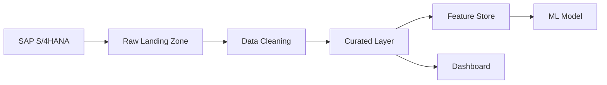

# D1 — Python Best Practices & Actionable Deliverables

> **Versión:** 1.0  
> **Fecha:** 2026-03-06  
> **Audiencia:** Equipos de desarrollo Data Science / Analytics / Engineering  

---

## Tabla de contenidos

| Sección | Título | Énfasis |
|---------|--------|---------|
| [D1.A.1](#d1a1-developer-environment--tools) | Developer Environment & Tools | |
| [D1.A.1.1](#d1a11-ide-and-developer-tooling-standards) | IDE and Developer Tooling Standards | |
| [D1.A.1.2](#d1a12-programming-language-standards) | Programming Language Standards | |
| [D1.A.1.3](#d1a13-ai-assisted-coding-tools) | AI Assisted Coding Tools | |
| [D1.A.2](#d1a2-documentation) | **Documentation** | ⭐ **FOCO PRINCIPAL** |
| [D1.A.2.1](#d1a21-in-code-documentation) | **In-Code Documentation** | ⭐ |
| [D1.A.2.1.1](#d1a211-docstring-standardization-google-style) | **Docstring Standardization** | ⭐ |
| [D1.A.2.1.2](#d1a212-api-documentation-generation) | **API Documentation Generation** | ⭐ |
| [D1.A.2.1.3](#d1a213-documentation-update-governance) | **Documentation Update Governance** | ⭐ |
| [D1.A.2.2](#d1a22-off-code-documentation) | **Off-Code Documentation** | ⭐ |
| [D1.A.2.3](#d1a23-data-documentation) | **Data Documentation** | ⭐ |
| [D1.A.3](#d1a3-code-structure-and-modularity) | Code Structure and Modularity | |
| [D1.A.3.1](#d1a31-modular-organization) | Modular Organization | |
| [D1.A.3.2](#d1a32-code-design-principles) | Code Design Principles | |
| [D1.A.3.3](#d1a33-code-maintainability-and-evolvability) | Code Maintainability & Evolvability | |

---

# D1.A.1 — Developer Environment & Tools

## D1.A.1.1 IDE and Developer Tooling Standards

### Objetivo
Garantizar un entorno de desarrollo **homogéneo** para todo el equipo, reduciendo errores de configuración y facilitando onboardings.

### Estándar

| Área | Herramienta / Configuración | Obligatoriedad |
|------|------------------------------|----------------|
| IDE principal | **VS Code** (última versión estable) | Obligatorio |
| Extensiones obligatorias | Python, Pylance, Black Formatter, isort, Ruff, GitLens, autoDocstring | Obligatorio |
| Extensiones recomendadas | GitHub Copilot, Docker, Jupyter, Rainbow CSV, YAML | Recomendado |
| Formateo automático | `black` (line-length = 120) | Obligatorio |
| Ordenación de imports | `isort` (profile = black) | Obligatorio |
| Linter | `ruff` (reglas: E, F, W, I, N, UP, S, B, A, C4, DTZ, T20, PT) | Obligatorio |
| Type checking | `mypy` (modo strict recomendado) | Recomendado |
| Pre-commit hooks | `pre-commit` framework | Obligatorio |

### Entregable accionable
📁 Fichero: [`templates/.vscode/settings.json`](templates/.vscode/settings.json)  
📁 Fichero: [`templates/.pre-commit-config.yaml`](templates/.pre-commit-config.yaml)

### Configuración `.vscode/settings.json` de referencia

```json
{
    "editor.formatOnSave": true,
    "editor.defaultFormatter": "ms-python.black-formatter",
    "editor.codeActionsOnSave": {
        "source.organizeImports": "explicit"
    },
    "[python]": {
        "editor.defaultFormatter": "ms-python.black-formatter",
        "editor.tabSize": 4
    },
    "black-formatter.args": ["--line-length", "120"],
    "isort.args": ["--profile", "black"],
    "python.analysis.typeCheckingMode": "basic",
    "autoDocstring.docstringFormat": "google",
    "autoDocstring.startOnNewLine": true,
    "files.trimTrailingWhitespace": true,
    "files.insertFinalNewline": true
}
```

### Configuración `.pre-commit-config.yaml` de referencia

```yaml
repos:
  - repo: https://github.com/pre-commit/pre-commit-hooks
    rev: v4.6.0
    hooks:
      - id: trailing-whitespace
      - id: end-of-file-fixer
      - id: check-yaml
      - id: check-added-large-files
        args: ['--maxkb=1000']
      - id: check-merge-conflict

  - repo: https://github.com/psf/black
    rev: 24.4.2
    hooks:
      - id: black
        args: ['--line-length=120']

  - repo: https://github.com/pycqa/isort
    rev: 5.13.2
    hooks:
      - id: isort
        args: ['--profile=black']

  - repo: https://github.com/astral-sh/ruff-pre-commit
    rev: v0.4.4
    hooks:
      - id: ruff
        args: ['--fix']

  - repo: https://github.com/pre-commit/mirrors-mypy
    rev: v1.10.0
    hooks:
      - id: mypy
        additional_dependencies: [types-requests]

  - repo: local
    hooks:
      - id: check-docstrings
        name: Check docstrings exist
        entry: python -m pydocstyle --convention=google
        language: python
        types: [python]
        additional_dependencies: [pydocstyle]
```

---

## D1.A.1.2 Programming Language Standards

### Objetivo
Establecer la versión de Python y las convenciones de estilo que todo código debe cumplir.

### Estándar

| Área | Estándar |
|------|----------|
| Versión de Python | **≥ 3.10** (preferiblemente 3.11+) |
| Guía de estilo | **PEP 8** aplicado via `black` + `ruff` |
| Type hints | Obligatorios en firmas de funciones públicas (PEP 484 / PEP 604) |
| Naming | `snake_case` funciones/variables, `PascalCase` clases, `UPPER_CASE` constantes |
| Encoding | UTF-8 en todos los ficheros |
| Line length | 120 caracteres máximo |
| Imports | Agrupados: stdlib → third-party → local (gestionado por `isort`) |

### Reglas de type hinting

```python
# ✅ Correcto — Python 3.10+
def calculate_metric(data: list[float], threshold: float | None = None) -> dict[str, float]:
    ...

# ❌ Incorrecto — estilo legacy
from typing import List, Dict, Optional
def calculate_metric(data: List[float], threshold: Optional[float] = None) -> Dict[str, float]:
    ...
```

### Gestión de entornos

| Herramienta | Uso |
|-------------|-----|
| `pyproject.toml` | Definición de proyecto, dependencias y configuración de herramientas |
| `uv` / `poetry` | Gestión de dependencias y lock files |
| `venv` / `conda` | Entornos virtuales aislados por proyecto |

---

## D1.A.1.3 AI Assisted Coding Tools

### Objetivo
Establecer directrices para el uso responsable de herramientas de IA en el desarrollo.

### Herramientas aprobadas

| Herramienta | Uso aprobado | Restricciones |
|-------------|-------------|---------------|
| **GitHub Copilot** | Autocompletado, generación de código, docstrings | No enviar datos confidenciales; revisar siempre el output |
| **Copilot Chat** | Explicación de código, refactoring, debugging | Validar sugerencias antes de aplicar |
| **ChatGPT / Claude** | Investigación, diseño de arquitectura, prototipado | No pegar código propietario del cliente |

### Reglas de uso

1. **Revisión humana obligatoria:** Todo código generado por IA debe ser revisado, comprendido y testeado antes de hacer commit.
2. **No datos sensibles:** Nunca enviar credenciales, datos PII, o código propietario del cliente a herramientas externas.
3. **Atribución:** Si un bloque significativo es generado por IA, añadir comentario `# AI-assisted` como referencia.
4. **Tests:** El código generado por IA requiere la misma cobertura de tests que el código manual.
5. **Docstrings:** Usar IA para generar docstrings iniciales, pero siempre revisar la precisión del contenido.

---

# D1.A.2 — Documentation ⭐

> **Esta sección es el foco principal del documento.** La documentación es un activo tan importante como el código. Sin documentación adecuada, el código pierde valor, se vuelve inmantenible y genera deuda técnica.

## Principios generales de documentación

| Principio | Descripción |
|-----------|-------------|
| **Docs-as-Code** | La documentación vive junto al código, se versiona con Git y se revisa en PRs |
| **Single Source of Truth** | Cada pieza de información existe en un único lugar |
| **Audiencia explícita** | Cada documento declara para quién está escrito |
| **Actualización continua** | La documentación se actualiza en el mismo PR que cambia el código |
| **Automatización** | Generar documentación automáticamente donde sea posible |

---

## D1.A.2.1 In-Code Documentation ⭐

### Objetivo
Que cualquier desarrollador pueda entender **qué hace**, **por qué existe** y **cómo usar** cualquier pieza de código leyendo exclusivamente el código fuente y sus docstrings.

---

### D1.A.2.1.1 Docstring Standardization — Google Style ⭐

> 📁 **Entregable accionable:** [`templates/docstring_examples.py`](templates/docstring_examples.py)

#### Estándar obligatorio

- **Formato:** Google Style (compatible con Sphinx, pdoc, mkdocstrings)
- **Herramienta IDE:** Extensión `autoDocstring` configurada con `"autoDocstring.docstringFormat": "google"`
- **Validación:** `pydocstyle --convention=google` integrado en pre-commit
- **Cobertura mínima:** 100% de funciones/clases/módulos públicos deben tener docstring

#### Reglas de docstrings

| Elemento | Docstring obligatorio | Contenido mínimo |
|----------|----------------------|-----------------|
| **Módulo** (.py file) | ✅ Sí | Descripción del propósito del módulo, autor, examples de uso |
| **Clase** | ✅ Sí | Descripción, Attributes, Example |
| **Método público** | ✅ Sí | Descripción, Args, Returns, Raises |
| **Método privado** (`_method`) | ⚠️ Recomendado | Al menos una línea descriptiva |
| **Método dunder** (`__init__`) | ✅ Sí | Args del constructor |
| **Función pública** | ✅ Sí | Descripción, Args, Returns, Raises, Example |
| **Función privada** | ⚠️ Recomendado | Al menos una línea descriptiva |
| **Constantes de módulo** | ⚠️ Recomendado | Comentario inline o docstring |
| **Property** | ✅ Sí | Descripción y tipo de retorno |

#### Anatomía de un docstring Google Style

```
"""[Resumen en una línea — imperativo, máx 79 chars.]

[Descripción extendida opcional. Puede ocupar múltiples líneas.
Explica el contexto, algoritmo o decisiones de diseño relevantes.]

Args:
    param1 (type): Descripción del parámetro.
    param2 (type): Descripción del parámetro.
        Continuación indentada si es largo.
    param3 (type, optional): Descripción. Defaults to valor.

Returns:
    type: Descripción de lo que se retorna.
        Para tipos complejos, detallar la estructura.

Raises:
    ExceptionType: Cuándo se lanza esta excepción.
    ValueError: Si param1 es negativo.

Yields:
    type: Descripción (solo para generadores).

Examples:
    >>> result = my_function(42, "hello")
    >>> print(result)
    {'status': 'ok'}

Note:
    Notas adicionales sobre uso, rendimiento o limitaciones.

See Also:
    related_function: Para un caso de uso similar.

Todo:
    * Implementar caché para mejorar rendimiento.
    * Añadir soporte para formato parquet.
"""
```

#### Ejemplos completos por tipo de elemento

##### Docstring de módulo

```python
"""Feature engineering utilities for time series models.

This module provides functions for creating lag features, rolling
statistics, and calendar-based features commonly used in demand
forecasting models.

The functions are designed to work with pandas DataFrames and follow
a consistent interface: input DataFrame → output DataFrame with new columns.

Typical usage:
    >>> import pandas as pd
    >>> from features import time_series as ts
    >>>
    >>> df = pd.read_parquet("sales.parquet")
    >>> df = ts.add_lag_features(df, column="sales", lags=[1, 7, 28])
    >>> df = ts.add_rolling_features(df, column="sales", windows=[7, 28])

Author:
    Data Science Team — Deloitte

Since:
    v1.2.0 (2026-01-15)
"""
```

##### Docstring de clase

```python
class TimeSeriesFeatureEngine:
    """Engine for generating time series features from tabular data.

    This class encapsulates the configuration and execution of feature
    engineering pipelines for time series forecasting. It supports lag
    features, rolling statistics, calendar features, and custom
    transformations.

    The engine follows a fit-transform pattern, where `fit()` learns
    necessary statistics (e.g., means for imputation) and `transform()`
    applies the feature generation.

    Attributes:
        lag_periods (list[int]): Lag periods to generate.
        rolling_windows (list[int]): Window sizes for rolling statistics.
        date_column (str): Name of the datetime column.
        target_column (str): Name of the target variable column.
        features_generated (list[str]): Names of features created after
            calling `transform()`. Empty before first transform.

    Example:
        >>> engine = TimeSeriesFeatureEngine(
        ...     lag_periods=[1, 7, 28],
        ...     rolling_windows=[7, 28],
        ...     date_column="date",
        ...     target_column="sales",
        ... )
        >>> engine.fit(train_df)
        >>> train_features = engine.transform(train_df)
        >>> test_features = engine.transform(test_df)

    Note:
        The input DataFrame must be sorted by date before calling
        `fit()` or `transform()`.

    See Also:
        CalendarFeatureEngine: For calendar-only features.
    """

    def __init__(
        self,
        lag_periods: list[int],
        rolling_windows: list[int],
        date_column: str = "date",
        target_column: str = "target",
    ) -> None:
        """Initialize the TimeSeriesFeatureEngine.

        Args:
            lag_periods: List of integers specifying lag periods.
                Each value generates a feature `{target}_lag_{n}`.
            rolling_windows: List of integers specifying rolling window sizes.
                Each value generates mean and std features.
            date_column: Name of the datetime column in the DataFrame.
                Defaults to "date".
            target_column: Name of the target variable column.
                Defaults to "target".

        Raises:
            ValueError: If any lag period or rolling window is not positive.
        """
        ...
```

##### Docstring de función

```python
def add_lag_features(
    df: pd.DataFrame,
    column: str,
    lags: list[int],
    group_columns: list[str] | None = None,
    fill_value: float | None = None,
) -> pd.DataFrame:
    """Add lag features to a DataFrame for a specified column.

    Creates new columns with shifted values of the target column.
    Supports grouped lag computation for panel data (e.g., multiple
    stores or products).

    The resulting columns are named `{column}_lag_{n}` where `n` is
    each lag period.

    Args:
        df: Input DataFrame. Must be sorted by the time dimension.
        column: Name of the column to create lags for.
        lags: List of positive integers specifying lag periods.
            Example: [1, 7, 28] creates 1-day, 7-day, and 28-day lags.
        group_columns: Columns to group by before computing lags.
            Use this for panel data. Defaults to None (no grouping).
        fill_value: Value to fill NaN positions created by the shift.
            Defaults to None (keeps NaN).

    Returns:
        pd.DataFrame: Copy of the input DataFrame with additional lag
            columns appended. Original columns are preserved unchanged.
            New columns follow the naming pattern `{column}_lag_{n}`.

    Raises:
        KeyError: If `column` or any of `group_columns` do not exist
            in the DataFrame.
        ValueError: If any value in `lags` is not a positive integer.
        TypeError: If `df` is not a pandas DataFrame.

    Examples:
        Simple lag without grouping:

        >>> df = pd.DataFrame({"date": pd.date_range("2026-01-01", periods=5), "sales": [10, 20, 30, 40, 50]})
        >>> result = add_lag_features(df, column="sales", lags=[1, 2])
        >>> result.columns.tolist()
        ['date', 'sales', 'sales_lag_1', 'sales_lag_2']

        Grouped lag for panel data:

        >>> result = add_lag_features(
        ...     df, column="sales", lags=[1], group_columns=["store_id"]
        ... )

    Note:
        For large DataFrames (>1M rows), consider using `lags` with
        fewer periods or applying this function per partition.

    Since:
        v1.0.0
    """
    ...
```

##### Docstring de property

```python
@property
def is_fitted(self) -> bool:
    """Whether the engine has been fitted with training data.

    Returns:
        True if `fit()` has been called successfully, False otherwise.
    """
    return self._fitted
```

##### Inline comments — Cuándo y cómo

```python
# ✅ BIEN — Explica el POR QUÉ, no el QUÉ
# Usamos mediana en vez de media para ser robustos ante outliers
fill_value = df[column].median()

# ✅ BIEN — Explica una decisión no obvia
# Offset de 1 día porque los datos se publican con un día de retraso
min_date = start_date - timedelta(days=1)

# ❌ MAL — Describe lo que ya es obvio por el código
# Incrementar el contador en 1
counter += 1

# ❌ MAL — Información que debería estar en el docstring
# Esta función calcula la media móvil
def rolling_mean(data):
    ...
```

#### Checklist de validación de docstrings

- [ ] ¿Tiene resumen en una línea (imperativo, < 79 chars)?
- [ ] ¿Todos los `Args` están documentados con tipo y descripción?
- [ ] ¿El `Returns` describe tipo y significado?
- [ ] ¿Los `Raises` cubren las excepciones posibles?
- [ ] ¿Tiene al menos un `Example` ejecutable?
- [ ] ¿Los types en docstring coinciden con los type hints?
- [ ] ¿Se ha ejecutado `pydocstyle --convention=google` sin errores?

---

### D1.A.2.1.2 API Documentation Generation ⭐

> 📁 **Entregable accionable:** [`templates/mkdocs.yml`](templates/mkdocs.yml)

#### Objetivo
Generar documentación de API **automáticamente** a partir de los docstrings del código, evitando duplicación y desincronización.

#### Stack recomendado

| Herramienta | Rol |
|-------------|-----|
| **MkDocs** | Generador de sitio estático |
| **Material for MkDocs** | Tema visual moderno |
| **mkdocstrings[python]** | Extrae docstrings y genera referencia API |
| **mkdocs-gen-files** | Genera páginas de referencia automáticamente |
| **mkdocs-literate-nav** | Navegación basada en ficheros |

#### Workflow

```
Docstrings (Google Style) en código
         │
         ▼
   mkdocstrings extrae
         │
         ▼
   MkDocs genera HTML
         │
         ▼
   CI/CD publica en cada merge a main
```

#### Configuración `mkdocs.yml`

```yaml
site_name: "My Project — API Reference"
site_description: "Auto-generated documentation from source code"
repo_url: https://github.com/org/my-project

theme:
  name: material
  features:
    - navigation.tabs
    - navigation.sections
    - navigation.expand
    - search.suggest
    - content.code.copy
  palette:
    - scheme: default
      primary: indigo
      accent: indigo

plugins:
  - search
  - mkdocstrings:
      handlers:
        python:
          options:
            docstring_style: google
            show_source: true
            show_root_heading: true
            show_root_full_path: false
            merge_init_into_class: true
            show_signature_annotations: true
            separate_signature: true
  - gen-files:
      scripts:
        - docs/gen_ref_pages.py
  - literate-nav:
      nav_file: SUMMARY.md

nav:
  - Home: index.md
  - User Guide:
      - Getting Started: guide/getting-started.md
      - Configuration: guide/configuration.md
  - API Reference: reference/

markdown_extensions:
  - admonitions
  - pymdownx.details
  - pymdownx.superfences
  - pymdownx.tabbed:
      alternate_style: true
  - toc:
      permalink: true
```

#### Script para generación automática de referencia

```python
"""Generate the code reference pages and navigation.

This script is run by mkdocs-gen-files during the build process.
It scans the source package and creates a markdown page for each module.
"""
from pathlib import Path
import mkdocs_gen_files

nav = mkdocs_gen_files.Nav()
src = Path("src")

for path in sorted(src.rglob("*.py")):
    module_path = path.relative_to(src).with_suffix("")
    doc_path = path.relative_to(src).with_suffix(".md")
    full_doc_path = Path("reference", doc_path)

    parts = tuple(module_path.parts)
    if parts[-1] == "__init__":
        parts = parts[:-1]
        doc_path = doc_path.with_name("index.md")
        full_doc_path = full_doc_path.with_name("index.md")
    elif parts[-1].startswith("_"):
        continue

    nav[parts] = doc_path.as_posix()

    with mkdocs_gen_files.open(full_doc_path, "w") as fd:
        ident = ".".join(parts)
        fd.write(f"::: {ident}")

    mkdocs_gen_files.set_edit_path(full_doc_path, path.as_posix())

with mkdocs_gen_files.open("reference/SUMMARY.md", "w") as nav_file:
    nav_file.writelines(nav.build_literate_nav())
```

#### Pipeline CI/CD para documentación

```yaml
# .github/workflows/docs.yml
name: Deploy Documentation
on:
  push:
    branches: [main]
  pull_request:
    branches: [main]

jobs:
  docs:
    runs-on: ubuntu-latest
    steps:
      - uses: actions/checkout@v4
      - uses: actions/setup-python@v5
        with:
          python-version: "3.11"
      - run: pip install mkdocs-material mkdocstrings[python] mkdocs-gen-files mkdocs-literate-nav
      - run: mkdocs build --strict  # Falla si hay warnings
      - if: github.ref == 'refs/heads/main'
        run: mkdocs gh-deploy --force
```

---

### D1.A.2.1.3 Documentation Update Governance ⭐

> 📁 **Entregable accionable:** [`templates/.github/pull_request_template.md`](templates/.github/pull_request_template.md)

#### Objetivo
Establecer un proceso **gobernado y verificable** que garantice que la documentación se mantiene actualizada con cada cambio de código.

#### Política: "No docs, no merge" 🚫

**Regla:** Todo Pull Request que modifique código público (interfaces, APIs, funciones exportadas) **debe** incluir la actualización de documentación correspondiente. Un PR sin documentación actualizada no puede ser aprobado.

#### Mecanismos de enforcement

| Mecanismo | Implementación | Automático |
|-----------|---------------|------------|
| **PR Template** | Checklist obligatorio en cada PR | Semi-auto |
| **CI Check — pydocstyle** | Valida docstrings Google Style | ✅ Sí |
| **CI Check — mkdocs build --strict** | Valida que la docs compila sin warnings | ✅ Sí |
| **CI Check — interrogate** | Mide cobertura de docstrings (mínimo 95%) | ✅ Sí |
| **Code Review** | Reviewer verifica documentación como parte del review | Manual |
| **CODEOWNERS** | El equipo de docs es owner de `/docs/` | ✅ Sí |

#### PR Template con checklist de documentación

```markdown
## Descripción
[Descripción del cambio]

## Tipo de cambio
- [ ] Bug fix
- [ ] Nueva feature
- [ ] Breaking change
- [ ] Refactoring

## Checklist de documentación 📝
- [ ] He añadido/actualizado docstrings (Google Style) para todas las funciones/clases nuevas o modificadas
- [ ] Los type hints están completos y correctos
- [ ] He actualizado el README si el cambio afecta al uso del proyecto
- [ ] He actualizado la documentación de API si he cambiado interfaces públicas
- [ ] He añadido/actualizado examples en los docstrings
- [ ] He ejecutado `pydocstyle --convention=google` sin errores
- [ ] He verificado que `mkdocs build --strict` pasa correctamente
- [ ] He actualizado el CHANGELOG.md

## Checklist general
- [ ] Mi código sigue los estándares de estilo del proyecto
- [ ] He escrito tests para los cambios
- [ ] Todos los tests pasan
- [ ] He revisado mi propio código antes de solicitar review
```

#### CI Pipeline para cobertura de docstrings

```yaml
# En .github/workflows/ci.yml
  docs-quality:
    runs-on: ubuntu-latest
    steps:
      - uses: actions/checkout@v4
      - uses: actions/setup-python@v5
        with:
          python-version: "3.11"
      - run: pip install pydocstyle interrogate
      - name: Check docstring style
        run: pydocstyle --convention=google src/
      - name: Check docstring coverage
        run: interrogate -v src/ --fail-under=95
```

#### Configuración de `interrogate` en `pyproject.toml`

```toml
[tool.interrogate]
ignore-init-method = false
ignore-init-module = true
ignore-magic = true
ignore-semiprivate = false
ignore-private = true
ignore-property-decorators = false
ignore-module = false
ignore-nested-functions = true
ignore-nested-classes = true
fail-under = 95
verbose = 2
color = true
omit-covered-files = false
```

#### Proceso de revisión de documentación

```
1. Desarrollador crea PR
         │
         ▼
2. CI ejecuta automáticamente:
   ├── pydocstyle (estilo)
   ├── interrogate (cobertura ≥ 95%)
   └── mkdocs build --strict (compilación)
         │
         ▼
3. SI algún check falla → PR bloqueado
         │
         ▼
4. Reviewer verifica:
   ├── ¿Docstrings son precisos y útiles?
   ├── ¿Examples son ejecutables?
   ├── ¿Se han actualizado docs de usuario si aplica?
   └── ¿CHANGELOG actualizado?
         │
         ▼
5. Merge solo si TODO está ✅
```

#### Revisiones periódicas de documentación

| Frecuencia | Actividad | Responsable |
|------------|-----------|-------------|
| Cada PR | Checklist de docs en review | Reviewer |
| Semanal | Revisión de `interrogate` coverage trends | Tech Lead |
| Mensual | Auditoría de docs obsoleta / stale | Doc Owner |
| Por release | Revisión completa de docs de usuario + API | Todo el equipo |

---

## D1.A.2.2 Off-Code Documentation ⭐

### D1.A.2.2.1 Repository-Level Documentation (READMEs) ⭐

> 📁 **Entregable accionable:** [`templates/README_TEMPLATE.md`](templates/README_TEMPLATE.md)

#### Estándar

Todo repositorio **debe** tener un `README.md` en el root que contenga **como mínimo**:

| Sección | Obligatorio | Descripción |
|---------|-------------|-------------|
| **Título y descripción** | ✅ | Qué es el proyecto y qué problema resuelve |
| **Badges** | ⚠️ Recomendado | CI status, coverage, versión, licencia |
| **Quick Start** | ✅ | Cómo instalar y ejecutar en < 5 minutos |
| **Requisitos** | ✅ | Python version, dependencias del sistema |
| **Instalación** | ✅ | Paso a paso para desarrollo local |
| **Uso** | ✅ | Ejemplos básicos de uso |
| **Estructura del proyecto** | ✅ | Árbol de directorios con descripciones |
| **Configuración** | ⚠️ Si aplica | Variables de entorno, ficheros de config |
| **Testing** | ✅ | Cómo ejecutar los tests |
| **Contributing** | ⚠️ Recomendado | Link a CONTRIBUTING.md |
| **Changelog** | ✅ | Link a CHANGELOG.md |
| **Licencia** | ✅ | Tipo de licencia |
| **Contacto** | ✅ | Equipo responsable |

#### Template de README

Ver el fichero completo en [`templates/README_TEMPLATE.md`](templates/README_TEMPLATE.md).

---

### D1.A.2.2.2 Cross-Repository Documentation (Wiki) ⭐

#### Objetivo
Centralizar el conocimiento compartido entre repositorios en una ubicación única y navegable.

#### Estrategia

| Plataforma | Uso |
|-----------|-----|
| **Confluence** / **SharePoint** | Documentación de alto nivel, arquitectura, decisiones estratégicas |
| **GitHub Wiki** / **GitLab Wiki** | Documentación técnica cross-repo, guías de onboarding |
| **MkDocs centralizado** | Portal de documentación técnica unificado |

#### Estructura de Wiki recomendada

```
wiki/
├── home.md                          # Índice principal
├── onboarding/
│   ├── getting-started.md           # Guía para nuevos miembros
│   ├── development-setup.md         # Setup del entorno
│   └── architecture-overview.md     # Visión general de la arquitectura
├── standards/
│   ├── coding-standards.md          # (link a este documento)
│   ├── git-workflow.md              # Branching, commits, PRs
│   ├── testing-standards.md         # Estrategia de testing
│   └── documentation-standards.md   # Estándares de documentación
├── architecture/
│   ├── system-design.md             # Arquitectura del sistema
│   ├── data-flow.md                 # Flujo de datos
│   ├── adr/                         # Architecture Decision Records
│   │   ├── 001-use-fastapi.md
│   │   ├── 002-event-driven.md
│   │   └── template.md
│   └── repository-map.md           # Mapa de repos y sus relaciones
├── runbooks/
│   ├── deployment.md                # Cómo hacer deploy
│   ├── incident-response.md         # Respuesta a incidentes
│   └── rollback.md                  # Procedimiento de rollback
└── glossary.md                      # Glosario de términos del dominio
```

#### Architecture Decision Records (ADR)

Cada decisión arquitectónica significativa se documenta como un ADR:

```markdown
# ADR-001: Uso de FastAPI como framework web

## Status
Accepted

## Context
Necesitamos un framework web para exponer modelos de ML como APIs REST.

## Decision
Usaremos FastAPI por su rendimiento, tipado nativo, y generación
automática de documentación OpenAPI.

## Consequences
- ✅ Documentación API auto-generada
- ✅ Validación de tipos en runtime con Pydantic
- ✅ Alto rendimiento (async)
- ⚠️ El equipo necesita formación en async Python
```

---

### D1.A.2.2.3 Maintained Versioned Documentation for Releases ⭐

> 📁 **Entregable accionable:** [`templates/CHANGELOG.md`](templates/CHANGELOG.md)

#### Estándar

| Elemento | Formato | Obligatorio |
|----------|---------|-------------|
| **CHANGELOG.md** | [Keep a Changelog](https://keepachangelog.com/) | ✅ |
| **Versionado** | [Semantic Versioning](https://semver.org/) (MAJOR.MINOR.PATCH) | ✅ |
| **Release notes** | Generadas automáticamente + curadas manualmente | ✅ |
| **Docs versionadas** | `mike` (MkDocs) para mantener docs por versión | ⚠️ Recomendado |

#### Formato de CHANGELOG

```markdown
# Changelog

All notable changes to this project will be documented in this file.

The format is based on [Keep a Changelog](https://keepachangelog.com/),
and this project adheres to [Semantic Versioning](https://semver.org/).

## [Unreleased]

### Added
- New feature X for handling Y.

### Changed
- Improved performance of Z by 40%.

## [1.2.0] - 2026-03-01

### Added
- `TimeSeriesFeatureEngine` class for automated feature generation.
- Support for custom rolling window functions.

### Changed
- `add_lag_features()` now supports grouped computation.
- Updated minimum Python version to 3.11.

### Deprecated
- `compute_lags()` — use `add_lag_features()` instead.

### Fixed
- Memory leak in rolling statistics computation (GH-142).

### Security
- Updated `cryptography` dependency to patch CVE-2026-XXXX.

## [1.1.0] - 2026-02-01
...
```

#### Documentación versionada con `mike`

```bash
# Publicar docs para una versión específica
mike deploy 1.2.0 latest --push

# Establecer la versión por defecto
mike set-default latest --push

# Listar versiones publicadas
mike list
```

---

## D1.A.2.3 Data Documentation ⭐

> 📁 **Entregable accionable:** [`templates/data_documentation_template.md`](templates/data_documentation_template.md)

#### Objetivo
Documentar los datasets, pipelines de datos y transformaciones para que cualquier miembro del equipo pueda entender el lineage y la semántica de los datos.

#### Elementos a documentar

| Elemento | Dónde documentar | Formato |
|----------|-----------------|---------|
| **Dataset / tabla** | `data/README.md` + data catalog | Markdown + YAML |
| **Columnas / features** | Data dictionary | Tabla Markdown o YAML |
| **Pipeline de datos** | `docs/data-pipeline.md` | Diagrama + descripción |
| **Transformaciones** | Docstrings en código + docs | Google Style docstrings |
| **Data quality rules** | `data/quality/` | Great Expectations / YAML |
| **Modelo de datos** | `docs/data-model.md` | Diagrama ER |

#### Template de Data Dictionary

```yaml
# data/dictionaries/sales_daily.yml
dataset:
  name: sales_daily
  description: "Daily aggregated sales data by store and product."
  source: "SAP S/4HANA → Data Lake → Feature Store"
  owner: "Data Engineering Team"
  update_frequency: "Daily (T+1)"
  granularity: "1 row = 1 store × 1 product × 1 day"
  row_count_approx: "~50M rows"
  time_range: "2020-01-01 to present"
  partitioned_by: "date"
  format: "Parquet (snappy)"
  location: "s3://data-lake/curated/sales/daily/"

columns:
  - name: date
    type: DATE
    description: "Date of the sales record."
    nullable: false
    example: "2026-01-15"

  - name: store_id
    type: STRING
    description: "Unique identifier for the store."
    nullable: false
    example: "ST-001"
    foreign_key: "stores.store_id"

  - name: product_id
    type: STRING
    description: "Unique identifier for the product (SKU level)."
    nullable: false
    example: "PRD-12345"
    foreign_key: "products.product_id"

  - name: quantity_sold
    type: INTEGER
    description: "Number of units sold."
    nullable: false
    constraints: ">= 0"
    example: 42

  - name: revenue_eur
    type: DECIMAL(12,2)
    description: "Total revenue in EUR including tax."
    nullable: false
    constraints: ">= 0"
    example: 1259.99

  - name: is_promotion
    type: BOOLEAN
    description: "Whether the product was on promotion that day."
    nullable: false
    example: true

quality_rules:
  - rule: "No nulls in primary key columns (date, store_id, product_id)"
    severity: critical
  - rule: "quantity_sold >= 0"
    severity: critical
  - rule: "revenue_eur >= 0"
    severity: critical
  - rule: "date <= current_date"
    severity: warning
  - rule: "No duplicate (date, store_id, product_id) combinations"
    severity: critical

lineage:
  upstream:
    - name: "raw_transactions"
      description: "Raw POS transaction data"
    - name: "promotion_calendar"
      description: "Promotion schedule from marketing"
  downstream:
    - name: "demand_forecast_features"
      description: "Feature table for forecasting model"
    - name: "sales_dashboard"
      description: "Daily sales KPI dashboard"
```

#### Documentación de pipeline de datos

Todo pipeline de datos debe tener un documento que incluya:

1. **Diagrama de flujo** (Mermaid o draw.io)
2. **Descripción de cada paso** con inputs/outputs
3. **Schedule** (cuándo corre)
4. **SLAs** (cuándo deben estar disponibles los datos)
5. **Contacto** del owner



---

# D1.A.3 — Code Structure and Modularity

## D1.A.3.1 Modular Organization

### Clean Project Layout

> 📁 **Entregable accionable:** [`templates/project_structure/`](templates/project_structure/)

#### Estructura estándar de proyecto Python

```
my_project/
├── .github/
│   ├── workflows/
│   │   ├── ci.yml                   # CI pipeline
│   │   └── docs.yml                 # Documentation deployment
│   ├── pull_request_template.md     # PR template con checklist
│   └── CODEOWNERS                   # Ownership de código
├── .vscode/
│   └── settings.json                # Configuración compartida del IDE
├── docs/
│   ├── index.md                     # Landing page de docs
│   ├── guide/
│   │   ├── getting-started.md
│   │   └── configuration.md
│   └── gen_ref_pages.py             # Script auto-generación API docs
├── src/
│   └── my_project/
│       ├── __init__.py              # Exports públicos del paquete
│       ├── py.typed                 # Marker para PEP 561
│       ├── core/                    # Lógica de negocio central
│       │   ├── __init__.py
│       │   ├── models.py            # Modelos de dominio
│       │   └── engine.py            # Lógica principal
│       ├── features/                # Feature engineering
│       │   ├── __init__.py
│       │   ├── time_series.py
│       │   └── categorical.py
│       ├── data/                    # Carga y acceso a datos
│       │   ├── __init__.py
│       │   ├── loaders.py
│       │   └── schemas.py
│       ├── api/                     # Capa de API (si aplica)
│       │   ├── __init__.py
│       │   ├── routes.py
│       │   └── dependencies.py
│       ├── config/                  # Configuración
│       │   ├── __init__.py
│       │   └── settings.py
│       └── utils/                   # Utilidades transversales
│           ├── __init__.py
│           ├── logging.py
│           └── validation.py
├── tests/
│   ├── conftest.py                  # Fixtures compartidas
│   ├── unit/
│   │   ├── test_engine.py
│   │   └── test_time_series.py
│   ├── integration/
│   │   └── test_pipeline.py
│   └── e2e/
│       └── test_api.py
├── data/
│   ├── README.md                    # Descripción de los datos
│   └── dictionaries/               # Data dictionaries
│       └── sales_daily.yml
├── notebooks/
│   ├── README.md
│   └── 01_exploratory_analysis.ipynb
├── scripts/
│   └── run_pipeline.py
├── .pre-commit-config.yaml
├── .gitignore
├── pyproject.toml
├── mkdocs.yml
├── README.md
├── CHANGELOG.md
├── CONTRIBUTING.md
└── LICENSE
```

### Principios de organización

| Principio | Regla |
|-----------|-------|
| **src layout** | El código fuente vive SIEMPRE bajo `src/package_name/` |
| **Single responsibility** | Cada módulo (.py) tiene un único propósito claro |
| **Separación de capas** | `core`, `data`, `api`, `config` son capas independientes |
| **Tests reflejan src** | La estructura de `tests/` espeja la de `src/` |
| **Notebooks separados** | Los notebooks viven en `notebooks/`, nunca en `src/` |
| **No circular imports** | Las dependencias fluyen: `api` → `core` → `data` → `utils` |

### `__init__.py` como contrato público

```python
"""My Project — Time series forecasting toolkit.

This package provides tools for demand forecasting including feature
engineering, model training, and serving.

Public API:
    - TimeSeriesFeatureEngine: Main feature engineering class.
    - add_lag_features: Function for creating lag features.
    - add_rolling_features: Function for creating rolling statistics.
"""

from my_project.core.engine import TimeSeriesFeatureEngine
from my_project.features.time_series import add_lag_features, add_rolling_features

__all__ = [
    "TimeSeriesFeatureEngine",
    "add_lag_features",
    "add_rolling_features",
]

__version__ = "1.2.0"
```

---

## D1.A.3.2 Code Design Principles

### Standards for Writing Clear, Pure Functions

```python
# ✅ BUENA función pura — sin side effects, determinista
def calculate_discount(price: float, discount_rate: float) -> float:
    """Calculate the discounted price.

    Args:
        price: Original price in EUR. Must be positive.
        discount_rate: Discount rate as a decimal (0.0 to 1.0).

    Returns:
        The discounted price, rounded to 2 decimal places.

    Raises:
        ValueError: If price is negative or discount_rate is not in [0, 1].
    """
    if price < 0:
        raise ValueError(f"Price must be non-negative, got {price}")
    if not 0 <= discount_rate <= 1:
        raise ValueError(f"Discount rate must be in [0, 1], got {discount_rate}")
    return round(price * (1 - discount_rate), 2)


# ❌ MALA función — side effects, depende de estado global
GLOBAL_TAX = 0.21

def calculate_discount(price, rate):
    price = price * (1 - rate)  # muta implícitamente
    price = price * (1 + GLOBAL_TAX)  # depende de global
    log_to_database(price)  # side effect oculto
    return price
```

#### Principios de funciones

| Principio | Descripción |
|-----------|-------------|
| **Pequeñas y enfocadas** | Máx ~30 líneas. Si es más larga, refactorizar. |
| **Un nivel de abstracción** | No mezclar lógica de alto nivel con detalles |
| **Sin side effects ocultos** | Si hay side effect, debe ser explícito en el nombre/doc |
| **Fail early** | Validar inputs al inicio con excepciones claras |
| **Type hints completos** | Todos los parámetros y retorno tipados |
| **Valores por defecto inmutables** | Nunca `def f(x=[])`. Usar `def f(x: list | None = None)` |

### Standards for Class Design

```python
from dataclasses import dataclass, field
from abc import ABC, abstractmethod


# ✅ Usar dataclasses para DTOs / value objects
@dataclass(frozen=True)
class ForecastResult:
    """Immutable container for a forecast result.

    Attributes:
        date: Forecast date.
        predicted_value: Point forecast.
        lower_bound: Lower confidence interval (95%).
        upper_bound: Upper confidence interval (95%).
    """
    date: str
    predicted_value: float
    lower_bound: float
    upper_bound: float


# ✅ Usar ABC para interfaces / contratos
class BaseForecaster(ABC):
    """Abstract base class for all forecasting models.

    Subclasses must implement `fit()` and `predict()` methods.
    """

    @abstractmethod
    def fit(self, train_data: pd.DataFrame) -> None:
        """Fit the model to training data."""
        ...

    @abstractmethod
    def predict(self, horizon: int) -> list[ForecastResult]:
        """Generate forecasts for the specified horizon."""
        ...


# ✅ Composición sobre herencia
class ForecastPipeline:
    """Pipeline that composes feature engineering and forecasting.

    Args:
        feature_engine: Engine for generating features.
        forecaster: Model for generating forecasts.
    """

    def __init__(
        self,
        feature_engine: TimeSeriesFeatureEngine,
        forecaster: BaseForecaster,
    ) -> None:
        self._feature_engine = feature_engine
        self._forecaster = forecaster
```

#### Principios de diseño de clases

| Principio | Regla |
|-----------|-------|
| **SRP** | Una clase, una responsabilidad |
| **Composición > Herencia** | Preferir inyectar dependencias que heredar |
| **Dataclasses** | Usar para datos sin lógica (DTOs, configs) |
| **ABC** | Usar para definir interfaces/contratos |
| **Inmutabilidad** | `frozen=True` en dataclasses cuando sea posible |
| **Encapsulación** | Atributos privados `_attr`, propiedades para acceso controlado |

### Guidelines for Packaging Python Code

```toml
# pyproject.toml
[build-system]
requires = ["hatchling"]
build-backend = "hatchling.build"

[project]
name = "my-project"
version = "1.2.0"
description = "Time series forecasting toolkit"
readme = "README.md"
license = {text = "MIT"}
requires-python = ">=3.10"
authors = [
    {name = "Data Science Team", email = "ds@company.com"},
]
dependencies = [
    "pandas>=2.0",
    "numpy>=1.24",
    "scikit-learn>=1.3",
]

[project.optional-dependencies]
dev = [
    "pytest>=8.0",
    "pytest-cov>=5.0",
    "black>=24.0",
    "ruff>=0.4",
    "mypy>=1.10",
    "pre-commit>=3.7",
]
docs = [
    "mkdocs-material>=9.5",
    "mkdocstrings[python]>=0.25",
]

[tool.black]
line-length = 120

[tool.isort]
profile = "black"

[tool.ruff]
line-length = 120
select = ["E", "F", "W", "I", "N", "UP", "S", "B", "A", "C4", "DTZ", "T20", "PT"]

[tool.pytest.ini_options]
testpaths = ["tests"]
addopts = "--cov=src/my_project --cov-report=term-missing --cov-fail-under=80"

[tool.mypy]
python_version = "3.11"
warn_return_any = true
warn_unused_configs = true
disallow_untyped_defs = true
```

---

## D1.A.3.3 Code Maintainability and Evolvability

### D1.A.3.3.1 Code Ownership (CODEOWNERS)

> 📁 **Entregable accionable:** [`templates/CODEOWNERS`](templates/CODEOWNERS)

```
# CODEOWNERS — Define who reviews changes to which parts of the codebase
# Docs: https://docs.github.com/en/repositories/managing-your-repositorys-settings-and-features/customizing-your-repository/about-code-owners

# Default owner for everything
*                           @org/data-science-team

# Core business logic — requires senior review
src/my_project/core/        @org/ds-senior-engineers

# API layer — requires backend review
src/my_project/api/         @org/backend-team @org/ds-senior-engineers

# Data layer and schemas
src/my_project/data/        @org/data-engineering

# Documentation
docs/                       @org/ds-tech-leads
*.md                        @org/ds-tech-leads
mkdocs.yml                  @org/ds-tech-leads

# CI/CD and infrastructure
.github/                    @org/platform-team
Dockerfile                  @org/platform-team

# Configuration and dependencies
pyproject.toml              @org/ds-senior-engineers
.pre-commit-config.yaml     @org/ds-senior-engineers
```

### D1.A.3.3.2 Strategy: MVP to Production

| Fase | Características | Entregables de documentación |
|------|----------------|------------------------------|
| **1. Prototype / Notebook** | Exploración en notebook, código informal | Notebook con markdown cells explicativas |
| **2. MVP Script** | Script funcional, tests mínimos | Docstrings básicos, README con quick start |
| **3. Package** | `src/` layout, tests, CI | Docstrings completos, API docs, CHANGELOG |
| **4. Production** | Monitoreo, logging, deployment | Runbooks, SLAs, data docs, ADRs |

#### Checklist de transición Notebook → Package

```markdown
## De Notebook a Package

### Fase 1: Extraer y estructurar
- [ ] Identificar funciones reutilizables en el notebook
- [ ] Crear módulos .py en `src/` con esas funciones
- [ ] Añadir type hints a todas las firmas
- [ ] Escribir docstrings Google Style completos
- [ ] Reemplazar magic numbers por constantes con nombre

### Fase 2: Calidad
- [ ] Escribir tests unitarios (cobertura ≥ 80%)
- [ ] Configurar `pyproject.toml`
- [ ] Configurar pre-commit hooks
- [ ] Ejecutar linters sin errores
- [ ] Configurar CI pipeline

### Fase 3: Documentación
- [ ] Escribir README completo
- [ ] Configurar MkDocs con mkdocstrings
- [ ] Crear CHANGELOG.md
- [ ] Documentar datos (data dictionary)
- [ ] Crear ADR para decisiones clave

### Fase 4: Productivización
- [ ] Añadir logging estructurado
- [ ] Configurar monitoreo
- [ ] Escribir runbook de deployment
- [ ] Definir SLAs
- [ ] Configurar CODEOWNERS
```

### D1.A.3.3.3 Deprecation and Retirement Plan

#### Proceso de deprecación

```python
import warnings
from typing import Any


def compute_lags(df: Any, col: str, lags: list[int]) -> Any:
    """Compute lag features for a column.

    .. deprecated:: 1.2.0
        Use :func:`add_lag_features` instead. This function will be
        removed in version 2.0.0.

    Args:
        df: Input DataFrame.
        col: Column name.
        lags: Lag periods.

    Returns:
        DataFrame with lag features.
    """
    warnings.warn(
        "compute_lags() is deprecated since v1.2.0 and will be removed in v2.0.0. "
        "Use add_lag_features() instead.",
        DeprecationWarning,
        stacklevel=2,
    )
    return add_lag_features(df, column=col, lags=lags)
```

#### Política de deprecación

| Paso | Acción | Timeline |
|------|--------|----------|
| 1 | Marcar como deprecated con `warnings.warn` | Release N |
| 2 | Documentar en CHANGELOG y docstring | Release N |
| 3 | Añadir `# TODO(v2.0): Remove deprecated function` | Release N |
| 4 | Emitir warnings en CI/CD para detectar uso | Release N → N+2 |
| 5 | Eliminar código deprecated | Release N+2 (mínimo 2 minor releases) |

---

# Resumen de Entregables Accionables

| ID | Entregable | Fichero | Sección |
|----|-----------|---------|---------|
| E1 | VS Code settings | `templates/.vscode/settings.json` | D1.A.1.1 |
| E2 | Pre-commit config | `templates/.pre-commit-config.yaml` | D1.A.1.1 |
| E3 | Docstring examples | `templates/docstring_examples.py` | D1.A.2.1.1 |
| E4 | MkDocs config | `templates/mkdocs.yml` | D1.A.2.1.2 |
| E5 | PR Template | `templates/.github/pull_request_template.md` | D1.A.2.1.3 |
| E6 | Docs CI pipeline | `templates/.github/workflows/docs.yml` | D1.A.2.1.2 |
| E7 | README Template | `templates/README_TEMPLATE.md` | D1.A.2.2.1 |
| E8 | CHANGELOG Template | `templates/CHANGELOG.md` | D1.A.2.2.3 |
| E9 | Data Dictionary Template | `templates/data_documentation_template.md` | D1.A.2.3 |
| E10 | Project Structure | `templates/project_structure/` | D1.A.3.1 |
| E11 | CODEOWNERS | `templates/CODEOWNERS` | D1.A.3.3.1 |
| E12 | pyproject.toml | `templates/pyproject.toml` | D1.A.3.2 |
| E13 | Doc Governance Checklist | `templates/doc_governance_checklist.md` | D1.A.2.1.3 |

---

> **Siguiente paso:** Ejecutar `python -m cookiecutter` o copiar la carpeta `templates/` para inicializar un nuevo proyecto siguiendo estos estándares.
