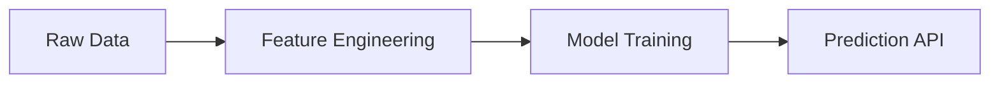

# VS Code Extensions — Standard Catalog

> **Module:** 01 — Programming Best Practices  
> **Date:** 2026-03-09  
> **Purpose:** Standardized list of VS Code extensions for all development teams

---

## How to Install

All extensions can be installed via the VS Code Extensions panel (`Ctrl+Shift+X`) or from the command line:

```bash
code --install-extension <extension-id>
```

---

## 1 — Core Python Development (Mandatory)

### 1.1 Python

| | |
|---|---|
| **Extension ID** | `ms-python.python` |
| **Publisher** | Microsoft |
| **Install** | [Marketplace](https://marketplace.visualstudio.com/items?itemName=ms-python.python) |

**Capabilities:**
- IntelliSense (code completion, parameter hints, quick info) powered by **Pylance**
- Automatic virtual environment detection and activation
- Code navigation (go to definition, find references, symbol search)
- Integrated linting support (ruff, flake8, pylint)
- Integrated formatting support (black, autopep8)
- Refactoring tools (rename symbol, extract method/variable)
- Import organization via isort
- Support for `pyproject.toml` and `settings.json` configuration
- Built-in test explorer integration for pytest and unittest

> This is the foundational extension — all other Python-related extensions depend on it.

---

### 1.2 Python Debugger

| | |
|---|---|
| **Extension ID** | `ms-python.debugpy` |
| **Publisher** | Microsoft |
| **Install** | [Marketplace](https://marketplace.visualstudio.com/items?itemName=ms-python.debugpy) |

**Capabilities:**
- Full-featured Python debugging using the `debugpy` engine
- Breakpoints (conditional, hit count, log points)
- Step into, step over, step out, continue execution
- Variable inspection, watch expressions, call stack navigation
- Debug console with live expression evaluation
- Multi-threaded and multi-process debugging
- Remote debugging (attach to running processes, containers, remote servers)
- Launch configuration templates for common scenarios (script, module, Django, FastAPI, pytest)

> Every developer must be proficient with the debugger — `print()` debugging is not acceptable for production code.

---

### 1.3 GitHub Copilot

| | |
|---|---|
| **Extension ID** | `GitHub.copilot` |
| **Publisher** | GitHub |
| **Install** | [Marketplace](https://marketplace.visualstudio.com/items?itemName=GitHub.copilot) |

**Capabilities:**
- AI-powered inline code completion that understands context across open files
- Chat interface for code explanations, refactoring suggestions, and Q&A
- Generates docstrings, unit tests, and boilerplate from natural language prompts
- Slash commands (`/fix`, `/explain`, `/tests`, `/doc`) for targeted assistance
- Supports multi-file context awareness

> See Module 01 AI-assisted coding guidelines for usage rules. **All AI-generated code must be reviewed, tested, and understood before committing.** Copilot is an accelerator, not a substitute for engineering judgment.

---

### 1.4 autoDocstring

| | |
|---|---|
| **Extension ID** | `njpwerner.autodocstring` |
| **Publisher** | Nils Werner |
| **Install** | [Marketplace](https://marketplace.visualstudio.com/items?itemName=njpwerner.autodocstring) |

**Capabilities:**
- Auto-generates **Google Style** docstring templates when typing `"""`
- Reads function signatures and pre-fills `Args`, `Returns`, `Raises` sections with parameter names and types
- Supports multiple docstring formats (Google, NumPy, Sphinx) — configure to **Google Style** in settings
- Works with type hints to auto-detect parameter and return types
- Tab-through placeholders for quick completion

> Enforces the documentation standard defined in Module 01. Configure once via `"autoDocstring.docstringFormat": "google"` in `settings.json`.

---

## 2 — Notebooks & Data Exploration (Mandatory)

### 2.1 Jupyter

| | |
|---|---|
| **Extension ID** | `ms-toolsai.jupyter` |
| **Publisher** | Microsoft |
| **Install** | [Marketplace](https://marketplace.visualstudio.com/items?itemName=ms-toolsai.jupyter) |

**Capabilities:**
- Native Jupyter Notebook (`.ipynb`) editing directly in VS Code
- Interactive cell execution with inline output rendering (tables, charts, images)
- Variable explorer for inspecting DataFrame shapes, types, and values
- Kernel management (local and remote Jupyter servers, conda environments)
- Markdown cell rendering with LaTeX math support
- Export notebooks to Python scripts (`.py`) and HTML
- Side-by-side diff view for notebook version control
- Integration with Data Wrangler for visual data exploration
- Support for Jupyter widgets (ipywidgets)

> Use notebooks for **exploration and prototyping only**. Production code must be extracted into proper Python packages (see Module 02).

---

### 2.2 Data Wrangler

| | |
|---|---|
| **Extension ID** | `ms-toolsai.datawrangler` |
| **Publisher** | Microsoft |
| **Install** | [Marketplace](https://marketplace.visualstudio.com/items?itemName=ms-toolsai.datawrangler) |

**Capabilities:**
- Visual, spreadsheet-like interface for exploring and transforming pandas DataFrames
- Launch directly from Jupyter notebooks or the Python interactive window
- Column-level statistics: data type, missing values, distribution histograms, min/max/mean
- Point-and-click filtering, sorting, and grouping
- Visual data transformations that auto-generate Python/pandas code
- Export generated transformation code back into your notebook or script
- Support for CSV, Parquet, and Excel files

> Accelerates exploratory data analysis. The auto-generated code can be reviewed, cleaned, and moved into production modules.

---

## 3 — Data Platform (Mandatory)

### 3.1 Snowflake

| | |
|---|---|
| **Extension ID** | `snowflake.snowflake-vsc` |
| **Publisher** | Snowflake |
| **Install** | [Marketplace](https://marketplace.visualstudio.com/items?itemName=snowflake.snowflake-vsc) |

**Capabilities:**
- Connect to Snowflake accounts directly from VS Code
- Write and execute SQL queries with syntax highlighting and auto-completion
- Browse databases, schemas, tables, views, stages, and functions in the object explorer
- View query results inline with sorting and filtering
- Snowflake-specific SQL dialect support (stages, streams, tasks, pipes)
- Query history and execution plan visualization
- Support for multi-statement execution and worksheet management
- Role and warehouse switching from the UI

> Essential for teams deploying Python packages to Snowflake stages and working with Snowpark. Eliminates the need to switch between VS Code and the Snowflake web UI.

---

## 4 — Documentation & Diagramming (Mandatory)

### 4.1 Markdown All in One

| | |
|---|---|
| **Extension ID** | `yzhang.markdown-all-in-one` |
| **Publisher** | Yu Zhang |
| **Install** | [Marketplace](https://marketplace.visualstudio.com/items?itemName=yzhang.markdown-all-in-one) |

**Capabilities:**
- Keyboard shortcuts for Markdown formatting (bold, italic, headings, lists)
- Auto-generation and update of Table of Contents (TOC)
- Live preview side-by-side with the editor
- Automatic list continuation and indentation
- Table formatting with alignment
- Link auto-completion (files, headings)
- Math rendering (KaTeX)
- Print Markdown to HTML

> All documentation in this repository is written in Markdown. This extension makes editing efficient and consistent.

---

### 4.2 Markdown Mermaid

| | |
|---|---|
| **Extension ID** | `bierner.markdown-mermaid` |
| **Publisher** | Matt Bierner |
| **Install** | [Marketplace](https://marketplace.visualstudio.com/items?itemName=bierner.markdown-mermaid) |

**Capabilities:**
- Renders **Mermaid diagrams** inside Markdown preview (flowcharts, sequence diagrams, class diagrams, Gantt charts, ER diagrams, etc.)
- Supports all standard Mermaid syntax
- Works with the built-in Markdown preview — no external tools needed
- Integrates with MkDocs and GitHub Markdown rendering

> Use Mermaid for all architecture diagrams, data flow diagrams, and process flows in documentation. Diagrams are version-controlled as text, not as binary image files.

**Example:**

````markdown

````

---

### 4.3 Excalidraw

| | |
|---|---|
| **Extension ID** | `pomdtr.excalidraw-editor` |
| **Publisher** | pomdtr |
| **Install** | [Marketplace](https://marketplace.visualstudio.com/items?itemName=pomdtr.excalidraw-editor) |

**Capabilities:**
- Create and edit **Excalidraw diagrams** (`.excalidraw` files) directly in VS Code
- Hand-drawn style whiteboard diagrams — ideal for architecture sketches, brainstorming, and informal documentation
- Version-controllable: `.excalidraw` files are JSON and can be diffed in Git
- Export to PNG and SVG for embedding in documentation
- Collaborative-style canvas with shapes, arrows, text, and connectors
- Library of reusable components

> Complements Mermaid's formal diagrams with informal, whiteboard-style architecture sketches and visual explanations.

---

## 5 — Data File Viewers (Recommended)

These extensions are not mandatory but significantly improve the experience when working with flat files and spreadsheets.

### 5.1 Rainbow CSV

| | |
|---|---|
| **Extension ID** | `mechatroner.rainbow-csv` |
| **Publisher** | mechatroner |
| **Install** | [Marketplace](https://marketplace.visualstudio.com/items?itemName=mechatroner.rainbow-csv) |

**Capabilities:**
- Color-codes columns in CSV, TSV, and pipe-delimited files for easy visual parsing
- Hover tooltip showing column name and index for the current field
- **RBQL** (Rainbow Query Language) — run SQL-like queries directly on CSV files without importing into pandas
- Automatic column alignment
- Supports custom delimiters
- CSVLint validation (detects broken rows, inconsistent column counts)

> Makes it possible to quickly inspect flat files without loading into a DataFrame.

---

### 5.2 Excel Viewer

| | |
|---|---|
| **Extension ID** | `GrapeCity.gc-excelviewer` |
| **Publisher** | GrapeCity |
| **Install** | [Marketplace](https://marketplace.visualstudio.com/items?itemName=GrapeCity.gc-excelviewer) |

**Capabilities:**
- View `.xlsx`, `.xls`, and `.csv` files directly in VS Code as a formatted spreadsheet
- Read-only rendering — opens instantly without launching Excel
- Column sorting and filtering
- Large file support (handles files with thousands of rows)
- Multiple sheet navigation for Excel workbooks

> Useful for quickly inspecting Excel files received as input data without leaving VS Code. Not a replacement for pandas — use only for visual inspection.

---

## Bulk Install Script

Save this as `install_extensions.sh` (or run line-by-line in your terminal):

```bash
# === Mandatory ===
code --install-extension ms-python.python
code --install-extension ms-python.debugpy
code --install-extension GitHub.copilot
code --install-extension njpwerner.autodocstring
code --install-extension ms-toolsai.jupyter
code --install-extension ms-toolsai.datawrangler
code --install-extension snowflake.snowflake-vsc
code --install-extension yzhang.markdown-all-in-one
code --install-extension bierner.markdown-mermaid
code --install-extension pomdtr.excalidraw-editor

# === Recommended ===
code --install-extension mechatroner.rainbow-csv
code --install-extension GrapeCity.gc-excelviewer
```

---

## VS Code Extensions File (`.vscode/extensions.json`)

Add this file to your repository root so VS Code prompts team members to install the required extensions:

```json
{
    "recommendations": [
        "ms-python.python",
        "ms-python.debugpy",
        "GitHub.copilot",
        "njpwerner.autodocstring",
        "ms-toolsai.jupyter",
        "ms-toolsai.datawrangler",
        "snowflake.snowflake-vsc",
        "yzhang.markdown-all-in-one",
        "bierner.markdown-mermaid",
        "pomdtr.excalidraw-editor",
        "mechatroner.rainbow-csv",
        "GrapeCity.gc-excelviewer"
    ]
}
```
